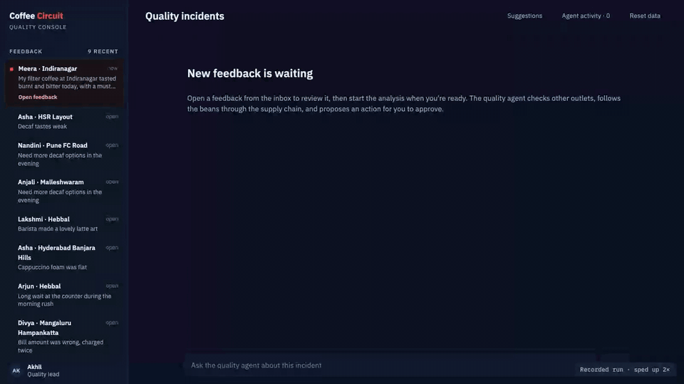
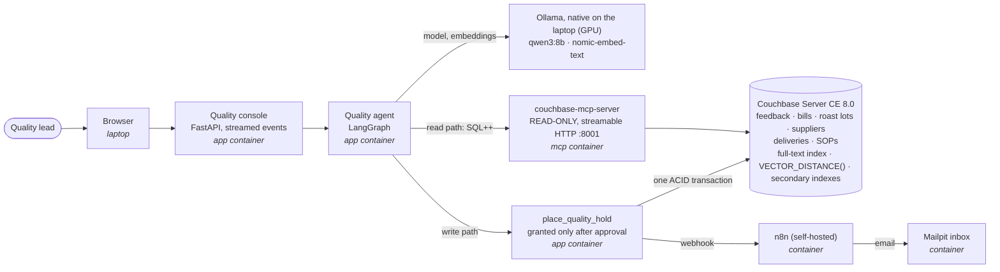

# coffee-circuit-agentic-data ☕

**A runnable reference implementation of a data architecture for AI agents.**

A small local AI agent investigates quality complaints at Coffee Circuit, a fictional chain of 300 South Indian
coffee outlets, and acts on them only with a human's approval. It runs on one laptop, offline after setup, on
Couchbase Server Community Edition, open‑source tools and self‑hosted n8n: no cloud services, no API keys.

[](docs/media/console-walkthrough.mp4)

<sub>Sped up 6×. [Full recording](docs/media/console-walkthrough.mp4) (52 s, sped up 2×).</sub>

## Patterns it implements

- **Embeddings:** every piece of feedback is embedded on write and stored next to its text.
- **Hybrid search:** keywords filter, meaning ranks, in one SQL++ query.
- **RAG with sources:** answers cite the quality procedure they came from.
- **Supply‑chain trace:** relationships stored as IDs in the documents, followed with joins.
- **MCP for reads:** the agent reaches the database through the open‑source Couchbase MCP server, read‑only.
- **Approved, all‑or‑nothing writes:** one narrow tool, granted only after approval, runs one ACID transaction;
  n8n then emails the managers.

## Architecture



Reads and writes take separate paths on purpose: the agent can read anything through the read‑only MCP server,
but it changes data only through one tool a person approves, which commits all of its changes or none.

## Run it

Needs macOS or Linux, [Docker](https://docs.docker.com/get-docker/), [uv](https://docs.astral.sh/uv/),
[Ollama](https://ollama.com) and about 8 GB of free RAM.

```bash
./scripts/up.sh              # models, containers, data and embeddings; safe to re-run
open http://localhost:8000   # the Quality console
```

Then open Meera's feedback, press **Start analysis**, and ask:

1. `Who else got these beans?`
2. `Hold those deliveries.`
3. Approve the hold, and check the managers' inbox at <http://localhost:8025>.

## More

- [`docs/ARCHITECTURE.md`](docs/ARCHITECTURE.md): where each pattern lives in the code, and the design choices.
- [`docs/RUNNING.md`](docs/RUNNING.md): commands, configuration, tests, troubleshooting and screenshots.

## Components and licences

| Component | Licence |
| --- | --- |
| This repository | Apache‑2.0 ([LICENSE](LICENSE)) |
| Couchbase Server Community Edition | Couchbase Community Edition licence (free) |
| couchbase‑mcp‑server, Couchbase Python SDK | Apache‑2.0 |
| LangGraph, LangChain, langchain‑mcp‑adapters, langchain‑ollama | MIT |
| Ollama, Mailpit | MIT |
| FastAPI, uvicorn | MIT, BSD-3-Clause |
| IBM Plex fonts (bundled in the console) | SIL Open Font License 1.1 |
| Qwen3, nomic‑embed‑text | Apache‑2.0 |
| n8n (self‑hosted) | Sustainable Use License (fair‑code) |

## Featured in

Used in the talk *Data Architecture for Agentic AI Systems* at Open Source India 2026, Bengaluru.

## Disclaimer

This is personal work, shared in a personal capacity. It does not represent the views of, and is not endorsed
or supported by, Couchbase or any other company. Coffee Circuit, its outlets, roasteries, estates and people
are fictional; all data is synthetic. The default credentials are for local containers only; do not expose
this stack to a network.
