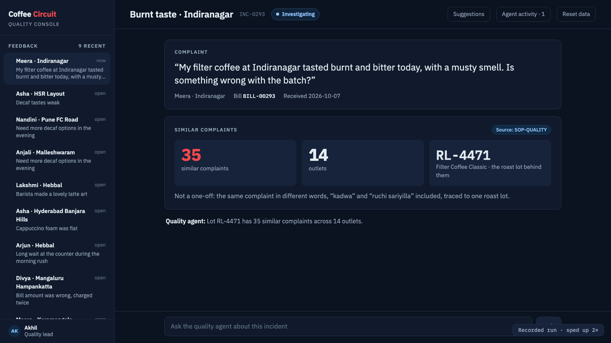
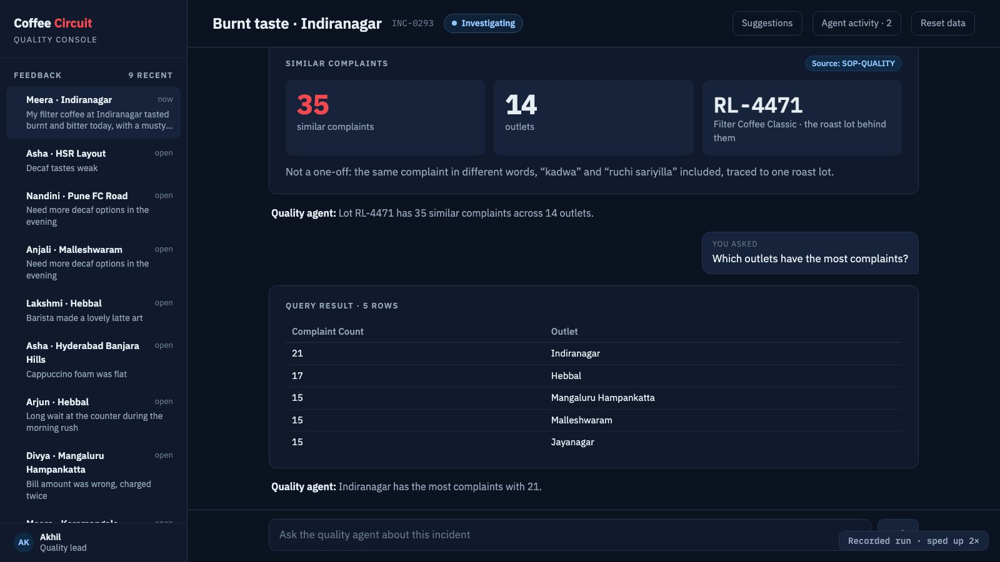
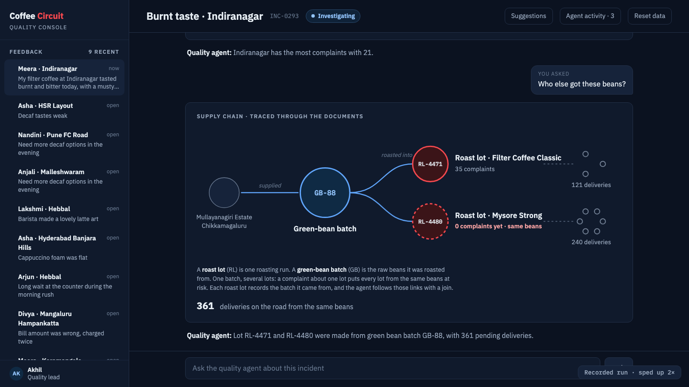
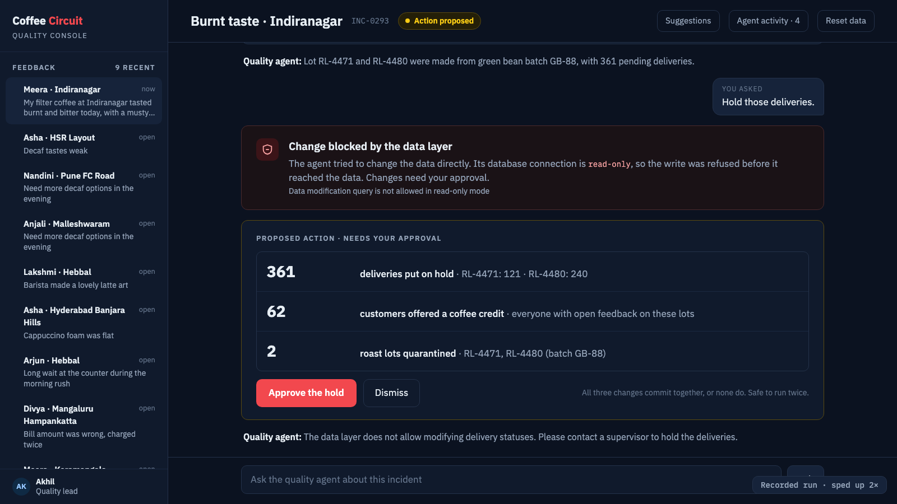
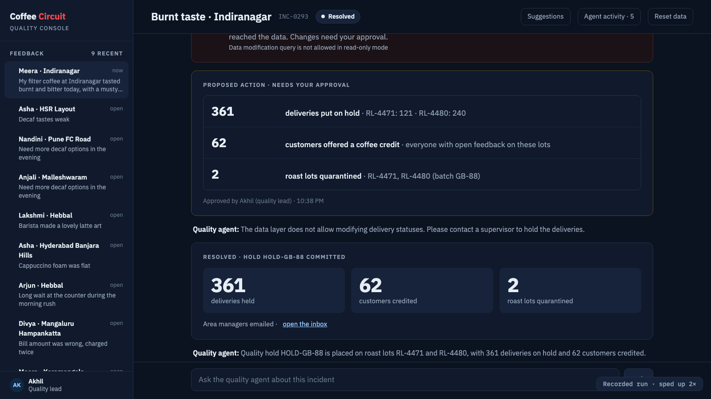

# Running it

## Setup

Requirements: macOS or Linux, [Docker](https://docs.docker.com/get-docker/) (≥ 4 GB for the VM),
[uv](https://docs.astral.sh/uv/), [Ollama](https://ollama.com), about 8 GB of free RAM.

```bash
./scripts/up.sh      # models, containers (incl. the app), bucket, indexes, n8n workflow, data and embeddings
open http://localhost:8000   # the Quality console
```

`up.sh` is safe to re-run. The first run downloads images and models (several minutes); later runs take
about a minute. Then:

| UI | URL |
| --- | --- |
| Quality console | <http://localhost:8000> (the `app` container) |
| Mailpit inbox (the managers' email) | <http://localhost:8025> |
| Couchbase Web Console | <http://localhost:8091> (credentials from `.env`, local only) |
| n8n | <http://localhost:5678> (owner credentials from `.env`) |
| MCP endpoint | <http://localhost:8001/mcp> (the `mcp` container) |

## Commands

```bash
docker compose exec app coffee walkthrough   # the same four steps in the terminal: type the questions, then /approve
docker compose exec app coffee reset         # reload the data and empty the inbox (the console has a button too)
docker compose stop                          # stop everything; `docker compose down -v` also deletes the data
uv run coffee web --port 8002                # development: run the console from source, outside Docker
```

In the console, **Agent activity** shows every tool call and the query behind it, and **Suggestions** shows the
next questions to ask. In the terminal, `/sql` at the `you ›` prompt shows the queries and `/quit` exits.

## Screenshots

| | |
| --- | --- |
|  |  |
| **1.** Meera's complaint, and 35 similar ones across 14 outlets, all from one roast lot | **Follow-up:** “Which outlets have the most complaints?” The agent writes a read-only query |
|  |  |
| **2.** The beans also went into RL‑4480, which has no complaints yet | **3.** The direct write is refused by the data layer; a proposal waits for approval |
|  | |
| **4.** One approval, one transaction: 361 deliveries held, 62 customers credited, 2 lots quarantined | |

## Configuration

`scripts/up.sh` creates `.env` from [`.env.example`](../.env.example) on first run and generates the n8n owner
password. All values are for local containers only.

| Variable | Default | Purpose |
| --- | --- | --- |
| `CB_USERNAME`, `CB_PASSWORD` | `Administrator` / `password` | Couchbase admin for the local container |
| `N8N_OWNER_EMAIL`, `N8N_OWNER_PASSWORD` | `owner@coffeecircuit.local` / generated | n8n owner account |
| `CHAT_MODEL` | `qwen3:8b` | the agent's model (Ollama) |
| `EMBED_MODEL` | `nomic-embed-text` | embedding model (Ollama) |
| `MCP_URL` | `http://localhost:8001/mcp` | the MCP server; `stdio` starts it as a child process instead |

## Tests

These need the running stack (`./scripts/up.sh`):

```bash
uv run python tests/smoke.py            # every query recipe and the read-only refusal; no LLM involved
uv run python tests/test_atomicity.py   # breaks write #3 on purpose, asserts writes #1 and #2 rolled back
uv run python tests/test_web.py         # the four steps through the console API, with the live model (~70 s)
```

CI ([`.github/workflows/ci.yml`](../.github/workflows/ci.yml)) runs lint, format and compile checks and the
deterministic data generator; it does not start Docker.

## Troubleshooting

| Problem | Fix |
| --- | --- |
| The model is slow (a step takes > 60 s) | Close heavy apps; heavy swap makes local models about 3× slower. Warm the model first: `ollama run qwen3:8b "hi"`. |
| The agent answers without calling a tool | Re-type the step's exact text from the [walkthrough](ARCHITECTURE.md#the-walkthrough-step-by-step). |
| “Already on hold” after `/approve` | Data from a previous run: `uv run coffee reset`. |
| No email in Mailpit | The hold is still committed; check `roast_lots` in the Couchbase console for `status: quarantined`. |
| The console says “Lost the connection” | The app container stopped: `docker compose up -d app`, then reload the page. |
| The console can't reach the model | Ollama must run on the host (`ollama serve` or the Ollama app); the container uses `host.docker.internal:11434`. |
| Couchbase not responding | `docker compose restart couchbase`, wait about 30 s, then `uv run python tests/smoke.py`. |
| MCP error at start on Apple silicon | `uv sync --managed-python` (the virtual environment must use a native arm64 Python). |

## Layout

```
coffee/      the agent: session (event stream), tools, MCP client, guarded write action, web console, terminal CLI
queries/     the SQL++ recipes the tools run
data/        deterministic synthetic data generator
ingest/      loads the data and creates embeddings
setup/       cluster, index, MCP and n8n initialisation
n8n/         the notification workflow
scripts/     up.sh: one command from clone to ready
tests/       smoke test, atomicity test, console API test
docs/        architecture, this page, screenshots and the recorded run
```
